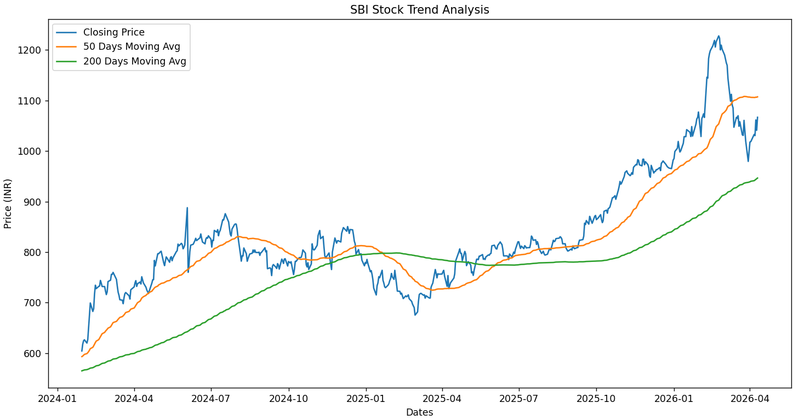

# 📈 Automated Financial Trend Analysis (EDA)

**Author**: Sahil Anand Utekar  
**Data Analyst Portfolio Project** | **Sector**: BFSI (Financial Markets)  

---

## 📌 Executive Summary
The objective of this project is to replace manual, Excel-based stock tracking with a fully automated Python data pipeline. I engineered a script that leverages the `yfinance` API to extract live historical market data, calculates complex financial indicators, and visually identifies long-term vs. short-term trend crossovers (Golden Cross/Death Cross) for major BFSI equities.

## 🛠️ Tech Stack & Methodology
* **Language:** Python
* **Libraries:** `pandas` (Data Manipulation), `matplotlib` (Data Visualization), `yfinance` (API Data Extraction).
* **Feature Engineering:** Programmatically calculated 50-Day and 200-Day Moving Averages to establish trendlines, and computed daily percentage returns to measure asset volatility.
* **Data Cleaning:** Implemented strict order-of-operations data handling to dynamically remove `NaN` values generated by rolling window calculations prior to visualization.

---

## 📊 Automated Output Visualization

---

## 💡 Technical & Business Impact
1. **Scalability:** By shifting away from static spreadsheets, this script can run an exploratory data analysis (EDA) on any publicly traded entity in the world simply by altering a single `ticker` variable. 
2. **Algorithmic Foundation:** The logic written to calculate the 50-day and 200-day moving averages serves as the foundational math required to build automated quantitative trading triggers.
3. **Reproducibility:** Eliminates human error in daily data entry and standardizes the reporting format for portfolio managers.